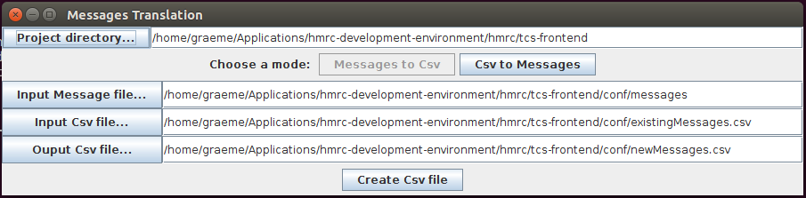
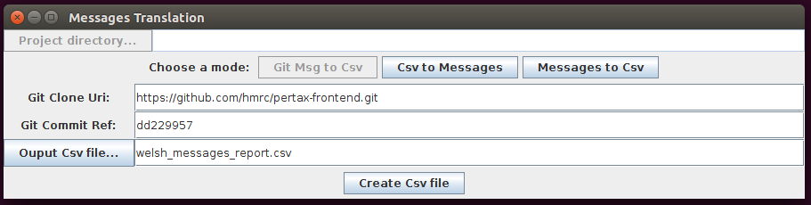

# translation

This tool is intended to make translation of English Play! Framework messages files to other languages (specifically Welsh), simpler.
It will extract English messages (key/value pairs) into a csv file, for translation.

Once the csv translatiofile has been populated and returned, the tool can extract the Welsh key/value pairs into a messages.cy file.

The tool may then be used to cross-reference the latest English messages file against the previously translated csv file, or against a specified git commit, to ensure sychnonisation. It will apply comments against each line, to indicate:
 - a new, untranslated English message
 - an existing, changed English message
 - an existing, unchanged English message, which already has a Welsh translation

# Executing

> sbt run

## Csv to Messages || Messages to Csv
1. Select your project directory
2. Select Mode, to covert from messages to csv, or csv to messages
3. Check the input and output files. (NB: the application will overwrite files, without confirmation)
4. Click the button at the bottom, to create the desired output file type.

## Git Msg to Csv (Compare current message versions, with a previous git commit)
1. Poplate the fields, to speficy which project/versions you want to compare.
2. Click the button at the bottom, to create the desired output file type.

# Example Output csv

| Key | English | Welsh | Comments |
| ----------|----------|----------|----------|
| pages.form.field.description.transferor-income	| Confirm your annual income	| Cadarnhau eich incwm blynyddol	| English message unchanged |
| title.eligibility |	Your relationship	| |	No Welsh translation found |
| title.dateOfBirth	| Your date of birth	| |	No Welsh translation found |
| pages.form.field.last-name.error.error.maxLength	| Use up to or no more than {0} letters. |	Defnyddiwch hyd at, neu ddim mwy na {0} llythrennau.	| English message unchanged |
| pages.form.field.description.gender |	Confirm your spouse or civil partner''s gender	| Cadarnhau eich priod neu eich partner sifil 'yn rhyw	| English message unchanged |
| coc.end-reason.SYSTEM	| Ended by HMRC	|	| No Welsh translation found |

# Process
 1. Create application, using Play i18n, with text in Messages file(s)
 2. Run **Message to Csv** conversion, to create a csv file, from the English Messages file.
 3. Send csv file to translators.
 4. Receive csv back, with translations populated.
 5. Extract the (Welsh) translations from the file, using this tool.
 7. In future, Run **Git Msg to Csv** against the current code, and the git commit ref, where the Welsh translations were last updated. If the newly created csv highlights any changes, this indicates that additional translations are required. I.e. the English file has changed since the specified git commit.
 
 
# Notes:
 1. Messages.en is the definitive hand-crafted list of messages in the project, so never auto generated.
 4. Messages.cy is always a straight generation from a csv file. New/Untranslated En messages are ignored (for now).
